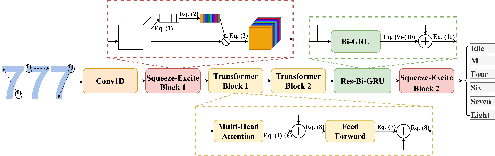
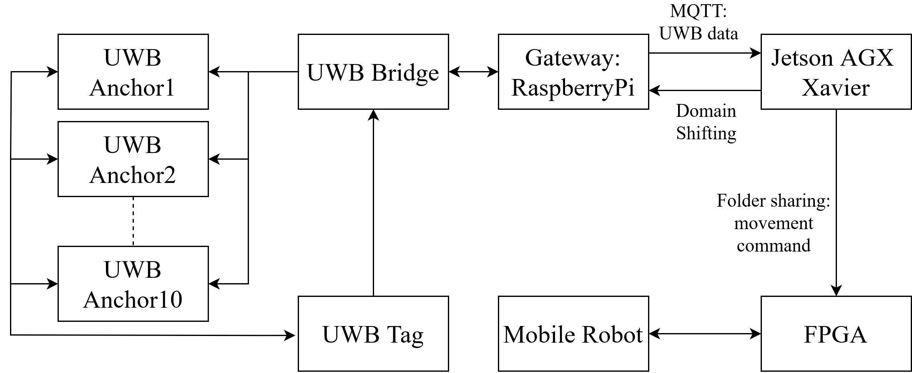
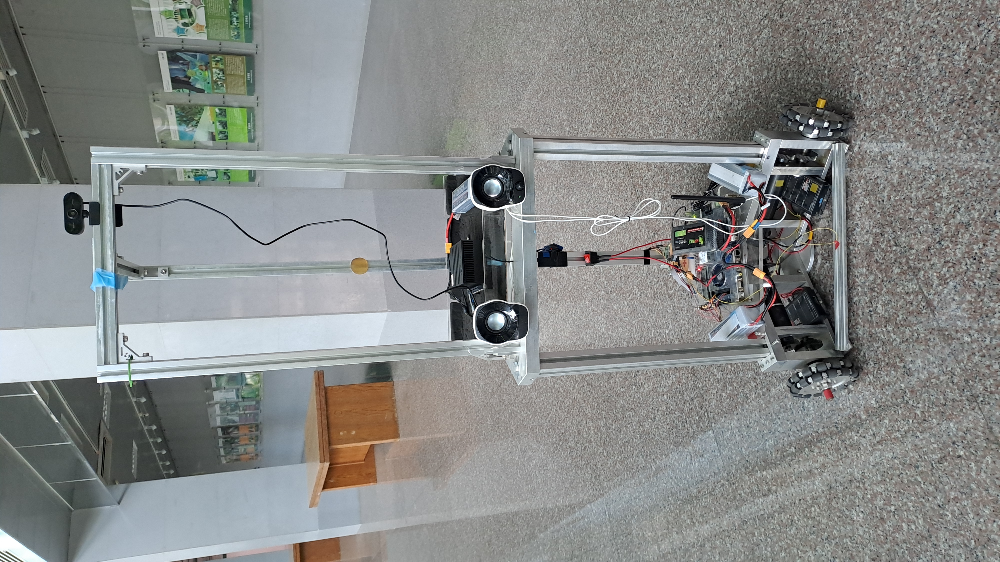
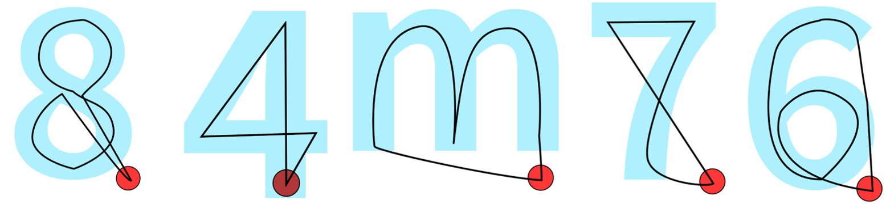
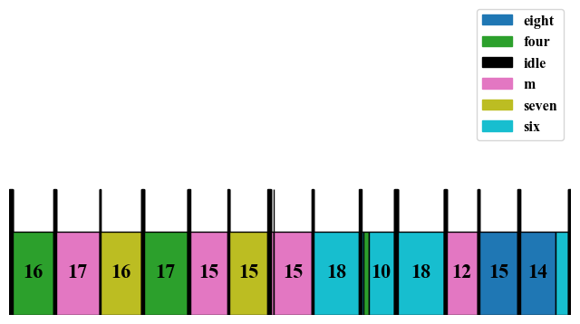

# SE-RBGRU-ETN: Gesture Control for Omni-Directional Mobile robot (ODMR)

  
*Figure 1 — The SE-RBGRU-ETN architecture*

---

## What This Is

This project enables **gesture-based control** of mobile robot using signal data from a **Distributed Ultra-Wideband (DUWB)** network.

It leverages a deep learning model — **SE-RBGRU-ETN** — trained to interpret UWB signal sequences as specific gesture commands. The system translates these into real-time movement instructions for a mobile robot.

---

## Core Workflow
  
*Figure 2 — System Diagram*
**From human gesture to mobile robot action:**

1. A user wears a UWB tag on their hand.
2. UWB tag position relayed through Raspberrypi gateway to Jetson AGX Xavier
3. The signal sequence is fed to the model
4. The output is mapped to a robot command (e.g., forward, backward, rotate clockwise, rotate counter-clockwise, change mode, rightward, leftward, ).
5. Command sent to FPGA
6. Mobile robot moves

---

## System Components

*Figure 3 — Mobile Robot*

- **Wearable UWB Tag** — worn on the hand  
- **Multiple UWB Anchors** — fixed around the environment  
- **Jetson AGX Xavier** — runs inference in real time  
- **FPGA**  — Controls the mobile robot
- **Mobile Robot** — Moves based on predicted gestures  

---

## Project Structure

| File               | Purpose                                      |
|--------------------|----------------------------------------------|
| `train and val.py` | Train the model using collected gesture data |
| `inference-pc.py`  | Run inference on standard computers          |
| `inference-jetson.py` | Optimized inference for Jetson devices    |
| `dataset.zip`      | Training and testing dataset (UWB signal sequences)      |

---

## Dataset Info
  
*Figure 4 — Gestures shape*
Collected using DUWB with labeled gestures, the dataset includes:
- Time-series signals from 4 UWB anchors
- Labels for each gesture performed ("m", "4", "6", "7", "8")

**Want to build your own dataset?**  
A collection script (`inference_pc.py`) is included to help you record new samples.

---

## Example Output

  
*Figure 5 — Output visualization*

The model enables smooth, real-time control with minimal misrecognition. It performs well even when gestures are performed at varying orientations and sub-regions.

---

## Maintainer

**Felix Gunawan**  
📫 [felix.iniemail@yahoo.com](mailto:felix.iniemail@yahoo.com)  
🔗 [linkedin.com/in/felixg26](https://linkedin.com/in/felixg26)  
🐙 [github.com/Felixgun](https://github.com/Felixgun)

